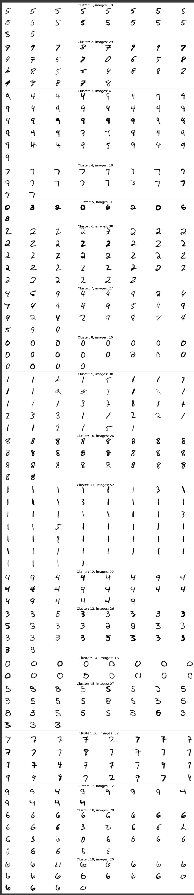
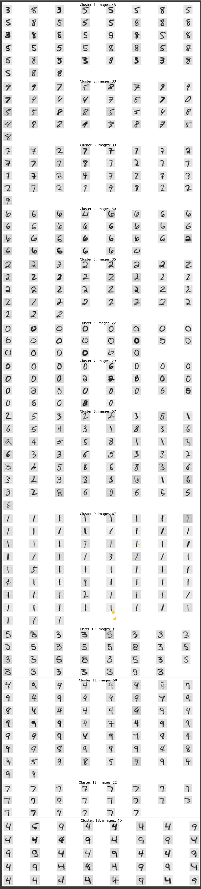
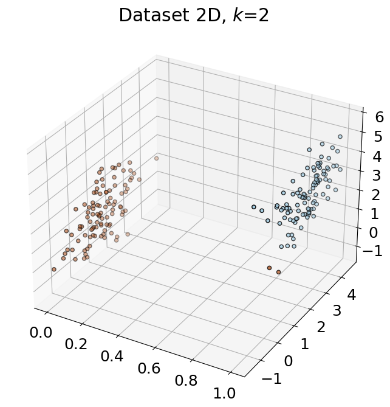
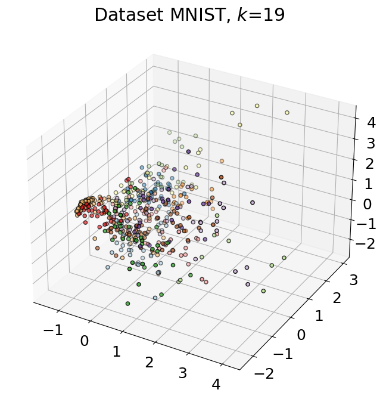

# Модуль 6. Навчання без вчителя.

*З циклу [домашніх завдань Python Data Science](https://github.com/lexxai/goit_python_data_sciense_homework).*

# Домашнє завдання

Завдання, що пропонуються, необхідно оформити у вигляді одного jupyter ноутбука.
## Завдання 1
У цьому завданні вам потрібно завантажити [ось цей датасет](https://drive.google.com/file/d/1Zvz20Iqeia1eEtFbGa3NcIrt_SNSimP6/view?usp=share_link). Тут ви знайдете 2 файли - з двовимірним датасетом та датасетом `mnist`. Для кожного з них застосуйте алгоритм `K-means` для кластеризації. Щоб знайти оптимальну кількість кластерів, скористайтесь ліктевим методом.

## Завдання 2
Візуалізуйте результат роботи кластеризації. Для випадку з `mnist` датасетом, вам потрібно ще скористатись алгоримтом `PCA` щоб зменшити розмірність вашим даних до 2-вимірного варіанту.

# Результат

- [goit_python_ds_hw_06.ipynb](goit_python_ds_hw_06.ipynb)
- [Collab](https://colab.research.google.com/drive/1SzdJuZXEjNaTOgB4evRvrxaxKQ7QD9WK?usp=sharing)

## Завдання 1

### Резульат розбитя на кластери зорбражень з бази MNIST
#### 784 ознак, k=19

#### PCA (0.95), 114 ознак, k=13

## Завдання 2

